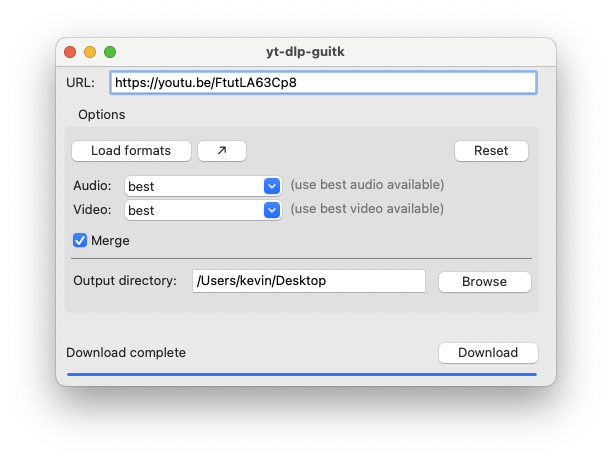

  

# yt-dlp-guitk

Do you like downloading stuff from YouTube? Do you dread using the terminal for it? You probably will appreciate this app.

This app is simply a GUI wrapper around [`yt-dlp`](https://github.com/yt-dlp/yt-dlp). If you are used to downloading videos from YouTube, then you are most likely familiar with the tool.

## Installation

This app is distributed as readily available executables via GitHub releases. You can check out the [latest release](https://github.com/kevinrpb/yt-dlp-guitk/releases/latest) and grab the app from there.

### Requirements

There are no requirements to use the app for downloading. It comes with `yt-dlp` embedded. However, if you need to merge audio/video files, [`ffmpeg`](https://ffmpeg.org/) is required to be present in your system (this is a requirement by `yt-dlp` since it uses `ffmpeg` fot the task).

## How to Use

The main tennet of this app was simplicity. You paste the URL you want to download and you click 'Download'. That's it.

For convenience, though, some options are available.

### File Formats

YouTube videos are usually available in multiple formats with different qualities (resolution), bitrates, etc. By default, the app will select the 'best' available format (this is what `yt-dlp` uses by default). If you need/want a specific format, you can first click on `Load formats`, and all the formats available will be selectable from the drop down controls. If you do not need to download either audio or video, you can set the format to `None`.

### Output Directory

By default, the app will try to set the output directory to your desktop folder. If you'd like to change that, a file browser is provided for that reason.

## Support / Requests

This app is a toy/hobby project. I mainly built it because my significant other needs to regularly download video/audio from YouTube but they are not specially savvy with terminals. As such, understand that the app is provided as-is and support will be limited.

If you have a request to make or would like to report a bug, please [open an issue](https://github.com/kevinrpb/yt-dlp-guitk/issues/new/choose) on the GitHub repo.

## Development

This section is mostly for me to keep track of things I would like to support/add. Contributions are also welcome.

### TODO

- [ ] Improve detection of `ffmpeg`.
  - When the app is run from an executable, it doesn't always have access to `PATH` (or it isn't complete, eg if our shell env didn't load it) and cannot just check whether the program is there.
  - Right now the app checks a couple known places in macOS, but it's probably not enough. It should be extended to other known locations of the program.
- [ ] Remember used formats.
  - When users select a specific format, we should remember it and try to use it for further downloads (`yt-dlp` supports providing several possible formats).
- [ ] Implement a 'format list' window.
  - This should show the list of formats with their full details.

## Credits

- [`yt-dlp`](https://github.com/yt-dlp/yt-dlp): The main tool that makes it trivial to download from YouTube.
- [`GUITk`](https://github.com/RhetTbull/guitk): Light wrapper over [`tkinter`](https://docs.python.org/3/library/tkinter.html) that makes building simple GUIs in Python a breeze.
